# 基于 XML 的集成教务系统数据集成报告

## 1. 项目概述

本系统面向多个学院教务系统之间的数据共享与业务协同问题，设计并实现了一个基于 XML 的集成教务系统。系统模拟三个学院分别使用不同数据库管理系统保存本院教务数据：学院 A 使用 SQL Server，学院 B 使用 Oracle，学院 C 使用 MySQL。各学院原始表结构和字段命名存在差异，系统通过统一的数据适配层、XML 契约、XSD 校验和 XSLT 转换实现跨系统数据集成。

系统主要完成以下功能：

- 三个学院学生、课程、选课数据的统一查询与展示。
- 各学院课程共享，支持将源学院课程转换成目标学院可识别的 XML 格式。
- 跨学院选课，支持外院学生选择目标学院共享课程。
- 集成环境退课，支持通过统一 XML 请求撤销选课记录。
- 全局统计与可视化，展示学生、课程、选课数量以及重叠课程情况。

项目采用前后端分离架构。后端使用 Spring Boot 提供 REST API、数据库适配、XML 导入导出、XSD 校验和 XSLT 转换；前端使用 React、Vite 和 TypeScript 实现登录、学院端页面、集成服务器页面和统计可视化页面。

## 2. 系统总体架构

系统由学院数据源、学院数据适配层、XML 集成服务、业务 API 和前端 GUI 五部分组成。学院数据源负责保存各学院本地数据；适配层将不同 DBMS 中的数据映射成统一领域模型；XML 集成服务负责统一 XML 生成、校验、转换和导入；业务 API 向前端提供学院查询、课程共享、跨院选课、退课和统计能力。

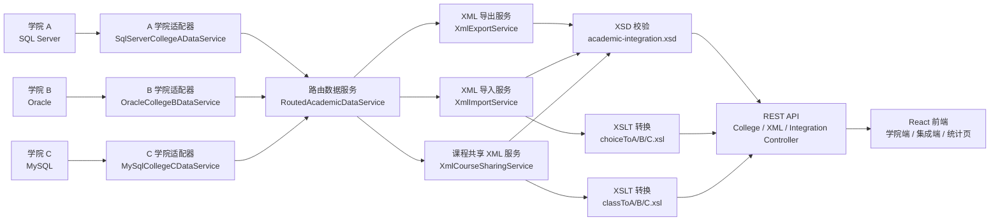

本项目部署上将教材中的 XMLClient、XMLServer 与集成服务器收敛到同一个 Spring Boot 应用内实现。这样做简化了课程项目的运行和演示，但逻辑上仍保留三个边界：各学院数据库适配器负责本地数据读写，XML 服务负责格式契约和转换，集成接口负责跨学院业务编排。

## 3. 异构数据源与统一模型

三个学院分别维护学生、课程和选课数据。为了体现异构数据集成特点，数据库初始化脚本位于 `database/sqlserver/init.sql`、`database/oracle/init.sql` 和 `database/mysql/init.sql`，每个学院包含 50 名学生、10 门课程和 250 条初始选课记录。

各学院通过视图或适配查询输出统一字段：

| 数据对象 | 统一字段 | 说明 |
| --- | --- | --- |
| 学生 | id、college、name、gender、major、grade | 表示学生所属学院、学号、姓名、性别、专业和年级 |
| 课程 | id、college、name、hours、credits、teacher、location、shared | 表示课程基本信息和是否可跨院选修 |
| 选课 | id、studentCollege、studentId、courseCollege、courseId、enrolledAt、status、score | 表示学生与课程之间的选课关系 |

后端使用 `AcademicDataService` 定义统一接口，数据库模式下由 `RoutedAcademicDataService` 根据学院代码路由到 A/B/C 三个学院适配器。默认演示模式为 `mock`，即使用内存示例数据；连接真实数据库时，可通过 `APP_DATA_MODE=database` 切换到数据库适配模式。

## 4. XML 契约设计

系统以 `backend/src/main/resources/academic-integration.xsd` 作为统一 XML Schema。统一契约覆盖五类文档根元素：

| XML 根元素 | 用途 | 核心内容 |
| --- | --- | --- |
| `students` | 学生列表导出 | `student` 包含 `id`、`name`、`sex`、`major` |
| `classes` | 课程列表导出 | `class` 包含 `id`、`name`、`time`、`score`、`teacher`、`location` |
| `choices` | 选课列表导出或导入 | 导出格式使用 `sid/cid/score`，导入格式支持跨院四元组 |
| `enrollmentRequests` | 跨院选课请求 | `studentCollege`、`studentId`、`courseCollege`、`courseId` |
| `withdrawRequests` | 集成退课请求 | `enrollmentId` |

XML 处理遵循“生成或接收后先校验，再解析或转换”的原则。导出接口由 `XmlExportService` 生成统一 XML 后执行 XSD 校验；导入接口由 `XmlImportService` 先校验统一 XML，再按目标学院生成本地选课 XML 并使用本地 XSD 校验；课程共享由 `XmlCourseSharingService` 先生成统一课程 XML，再通过 XSLT 转换为目标学院格式。

## 5. 数据集成功能流程

### 5.1 XML 数据导出流程

XML 导出用于将学院端数据以统一格式暴露给集成服务器或调试工具。前端或调用方访问 `/api/xml/{college}/students`、`/courses`、`/enrollments` 后，后端根据学院代码读取对应数据，序列化成统一 XML，随后执行 XSD 校验并返回。

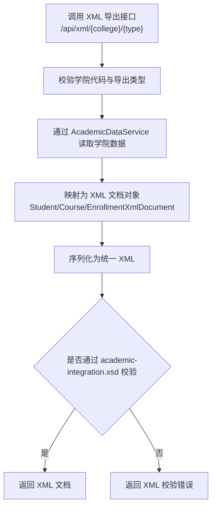

### 5.2 课程共享流程

课程共享功能用于将某一学院的共享课程发布给其他学院使用。系统先从源学院读取 `shared=true` 的课程，生成统一 `classes` XML，然后根据目标学院选择 `classToA.xsl`、`classToB.xsl` 或 `classToC.xsl` 转换成本地 XML 格式，并使用目标学院本地课程 XSD 校验。

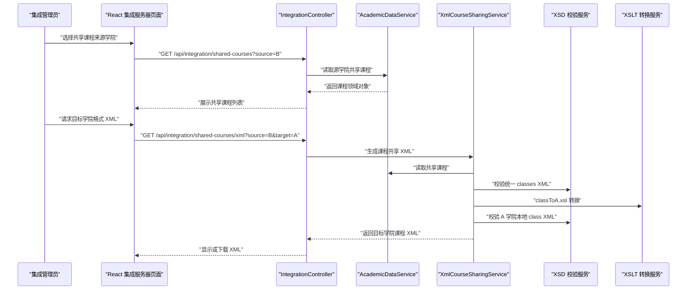

### 5.3 跨学院选课流程

跨学院选课是系统的核心集成功能。以 A 学院学生选择 B 学院共享课程为例，前端生成 `enrollmentRequests` XML 并提交到 `/api/integration/enrollments/xml`。后端先按统一 XSD 校验请求，再解析成 `EnrollmentCreateRequest`。随后系统根据目标课程学院路由到对应学院服务，若学生来自外院，则先补充外院学生导入记录，再写入目标学院导入选课表。

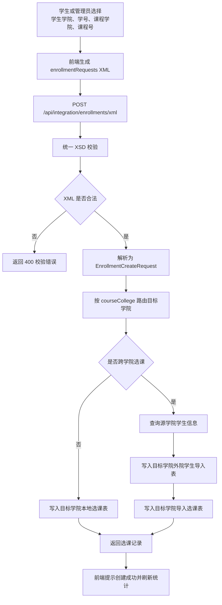

跨院选课请求示例：

```xml
<enrollmentRequests>
  <enrollmentRequest>
    <studentCollege>A</studentCollege>
    <studentId>202300000001</studentId>
    <courseCollege>B</courseCollege>
    <courseId>B0001</courseId>
  </enrollmentRequest>
</enrollmentRequests>
```

### 5.4 集成环境退课流程

退课功能通过统一 `withdrawRequests` XML 表示要撤销的选课记录。后端校验 XML 后提取 `enrollmentId`，再依次尝试在 A/B/C 学院服务中执行退选。数据库模式下，目标学院服务会删除或更新本地选课表、导入选课表中的对应记录；演示模式下，内存记录状态会更新为 `WITHDRAWN`。

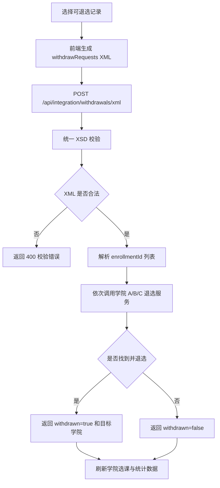

### 5.5 全局统计流程

统计功能面向集成服务器管理员，用于展示所有学院的数据规模和课程重叠情况。后端汇总 A/B/C 三个学院学生、课程和选课数量，并按课程名称识别多个学院共同开设的课程。

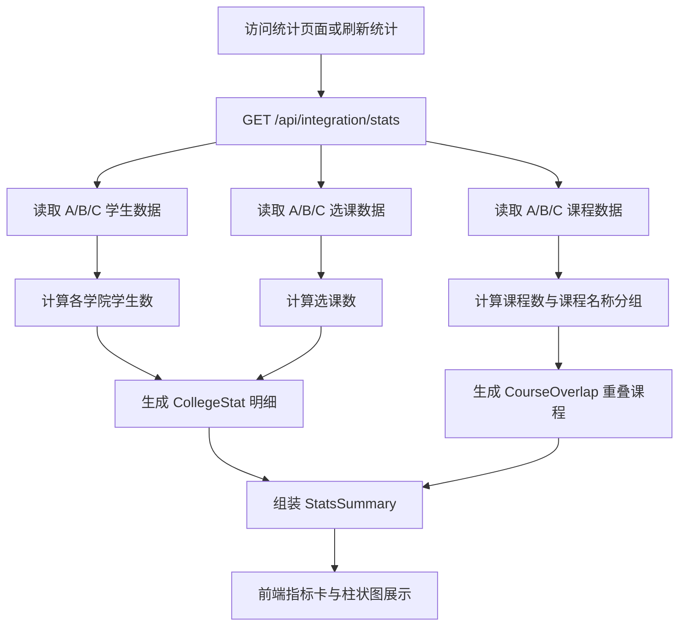

### 5.6 数据集成异常处理流程

数据集成过程中可能出现参数错误、XML 格式不符合契约、XSLT 转换失败或目标学院写入失败等情况。系统在进入业务写入前先完成参数检查和 XSD 校验，避免无效数据进入学院数据库；如果处理失败，接口会返回明确错误信息，便于前端展示和演示排查。

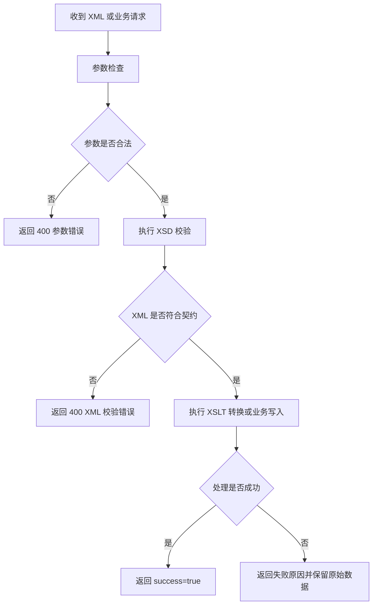

## 6. 前端功能说明

前端提供四类主要页面：

| 页面 | 作用 | 演示重点 |
| --- | --- | --- |
| 登录页 | 选择学院用户或集成管理员登录 | 演示角色入口 |
| 学院端页面 | 展示学院学生、课程、选课信息 | 展示三院异构数据统一呈现 |
| 集成服务器页面 | 管理共享课程、跨院选课和退课 | 展示 XML 数据集成核心流程 |
| 统计可视化页面 | 展示全局统计和重叠课程 | 展示集成后的汇总价值 |

1. 登陆页
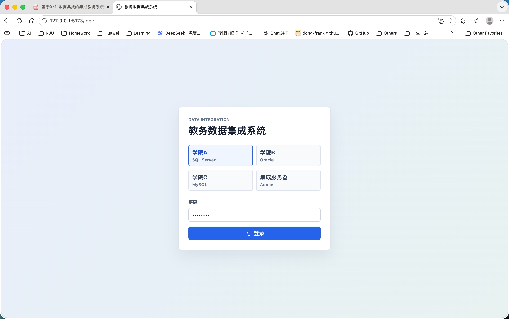

2. 学院端页面
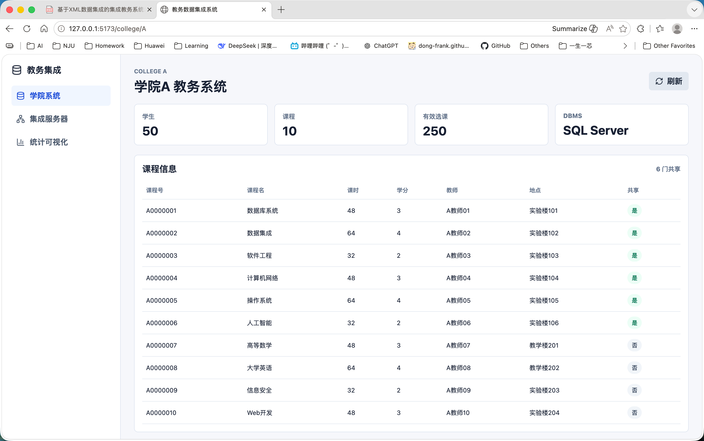

3. 集成服务器页面
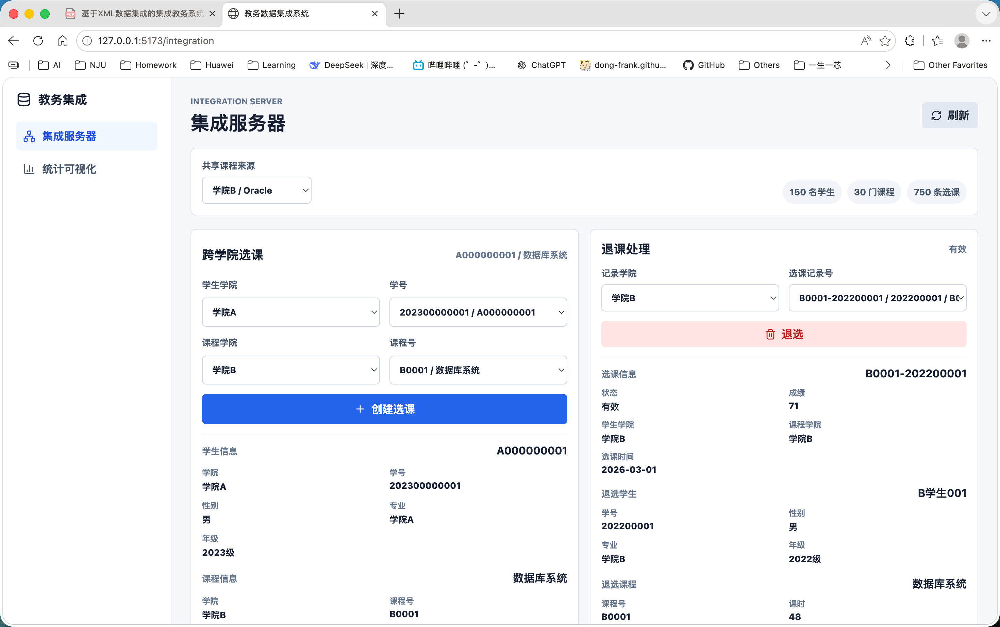

4. 统计可视化页面
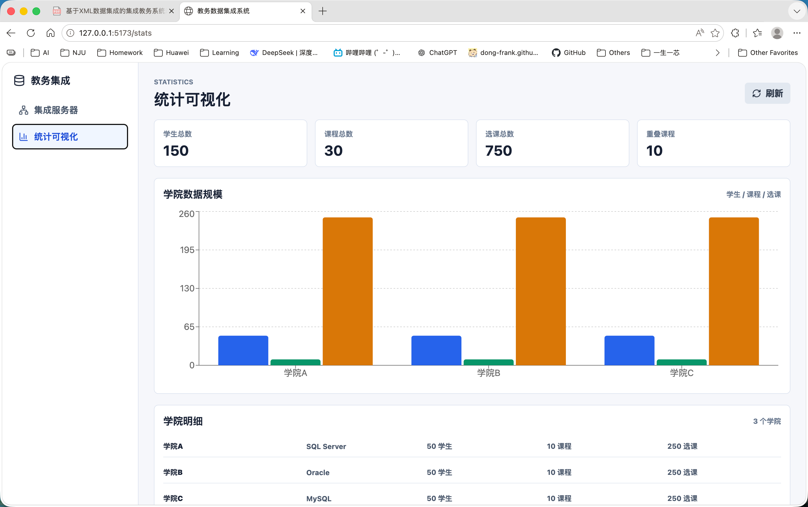

演示账号如下：

| 用户名 | 密码 | 角色 |
| --- | --- | --- |
| `college-a` | `password` | 学院 A |
| `college-b` | `password` | 学院 B |
| `college-c` | `password` | 学院 C |
| `integration-admin` | `password` | 集成服务器管理员 |

## 7. 接口与关键实现

系统关键接口如下：

| 接口 | 方法 | 功能 |
| --- | --- | --- |
| `/api/health` | GET | 服务健康检查 |
| `/api/auth/login` | POST | 演示登录 |
| `/api/college/{college}/students` | GET | 查询学院学生 |
| `/api/college/{college}/courses` | GET | 查询学院课程 |
| `/api/college/{college}/enrollments` | GET | 查询学院选课 |
| `/api/xml/{college}/{type}` | GET | 导出统一 XML |
| `/api/integration/shared-courses` | GET | 查询共享课程 |
| `/api/integration/shared-courses/xml` | GET | 共享课程 XML 转换 |
| `/api/integration/enrollments/xml` | POST | XML 跨学院选课 |
| `/api/integration/withdrawals/xml` | POST | XML 集成退课 |
| `/api/integration/stats` | GET | 全局统计 |

关键实现类包括：

- `XmlExportService`：生成学生、课程、选课统一 XML 并校验。
- `XmlImportService`：导入跨院选课和退课 XML，负责解析、转换、校验和业务调用。
- `XmlCourseSharingService`：生成共享课程 XML，并转换为目标学院本地格式。
- `XmlSchemaValidationService`：执行统一 XSD 和本地 XSD 校验。
- `XmlTransformService`：执行 XSLT 转换。
- `RoutedAcademicDataService`：在数据库模式下按学院路由到 SQL Server、Oracle、MySQL 适配器。
