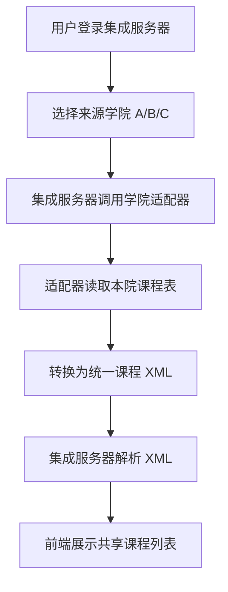
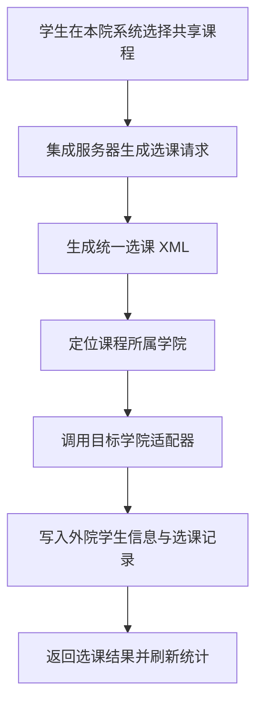
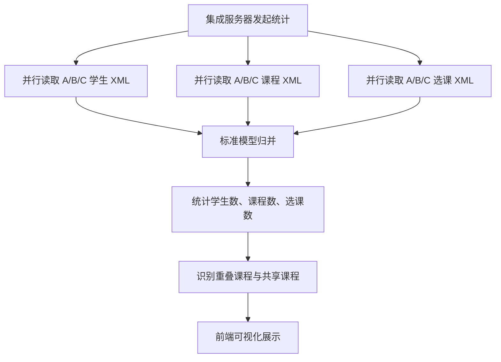
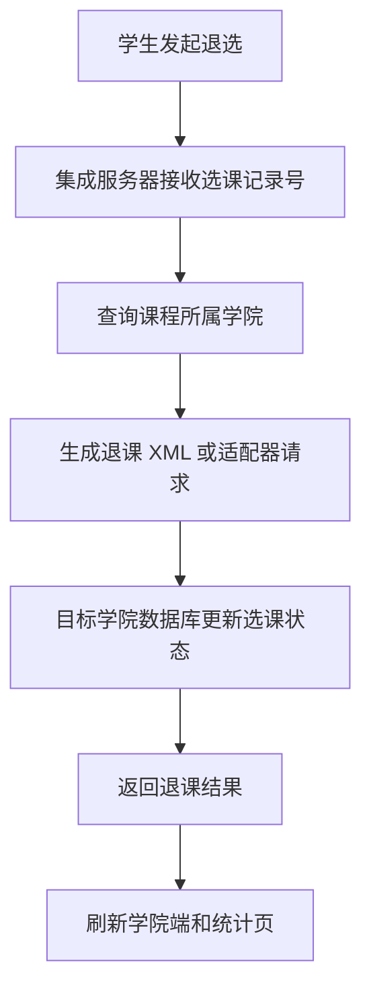

# 系统数据集成流程图草稿

## 共享课程查询流程

```mermaid
flowchart TD
  A["用户登录集成服务器"] --> B["选择来源学院 A/B/C"]
  B --> C["集成服务器调用学院适配器"]
  C --> D["适配器读取本院课程表"]
  D --> E["转换为统一课程 XML"]
  E --> F["集成服务器解析 XML"]
  F --> G["前端展示共享课程列表"]
```

## 跨院选课写回流程

```mermaid
flowchart TD
  A["学生在本院系统选择共享课程"] --> B["集成服务器生成选课请求"]
  B --> C["生成统一选课 XML"]
  C --> D["定位课程所属学院"]
  D --> E["调用目标学院适配器"]
  E --> F["写入外院学生信息与选课记录"]
  F --> G["返回选课结果并刷新统计"]
```

## 全局统计汇总流程

```mermaid
flowchart TD
  A["集成服务器发起统计"] --> B["并行读取 A/B/C 学生 XML"]
  A --> C["并行读取 A/B/C 课程 XML"]
  A --> D["并行读取 A/B/C 选课 XML"]
  B --> E["标准模型归并"]
  C --> E
  D --> E
  E --> F["统计学生数、课程数、选课数"]
  F --> G["识别重叠课程与共享课程"]
  G --> H["前端可视化展示"]
```

## 集成环境退课流程

```mermaid
flowchart TD
  A["学生发起退选"] --> B["集成服务器接收选课记录号"]
  B --> C["查询课程所属学院"]
  C --> D["生成退课 XML 或适配器请求"]
  D --> E["目标学院数据库更新选课状态"]
  E --> F["返回退课结果"]
  F --> G["刷新学院端和统计页"]
```
