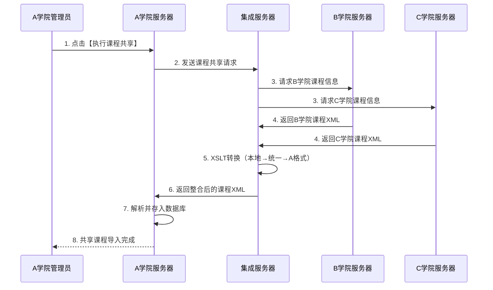
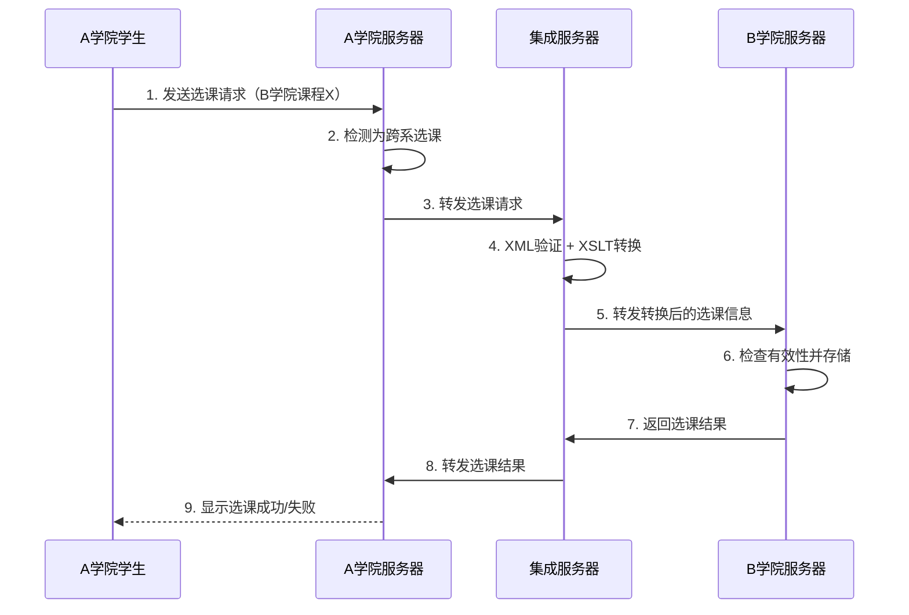
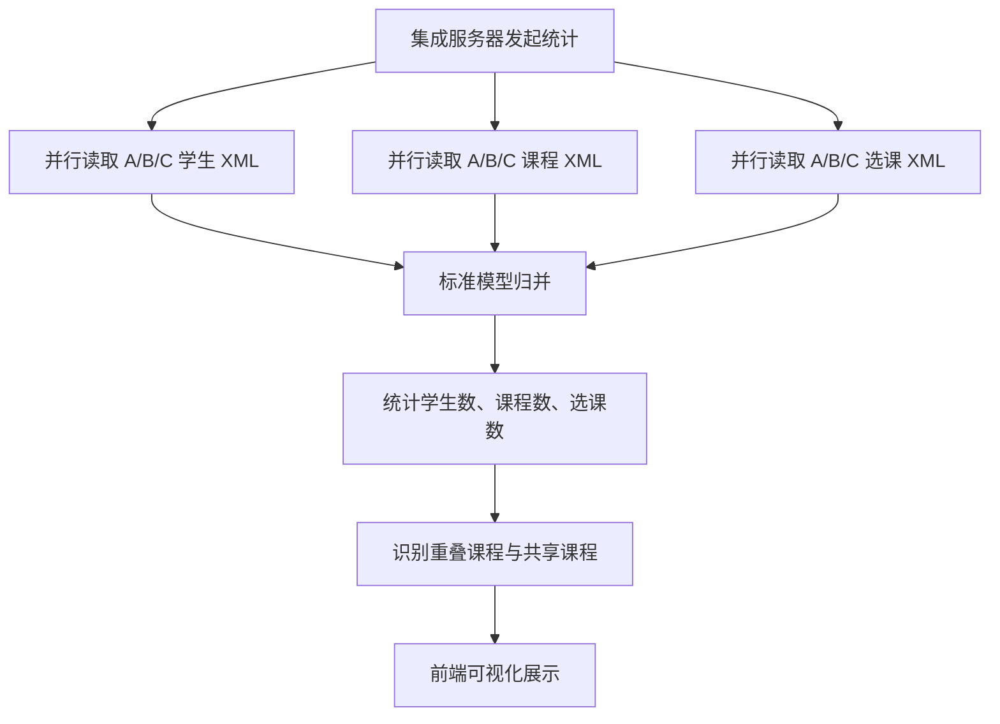
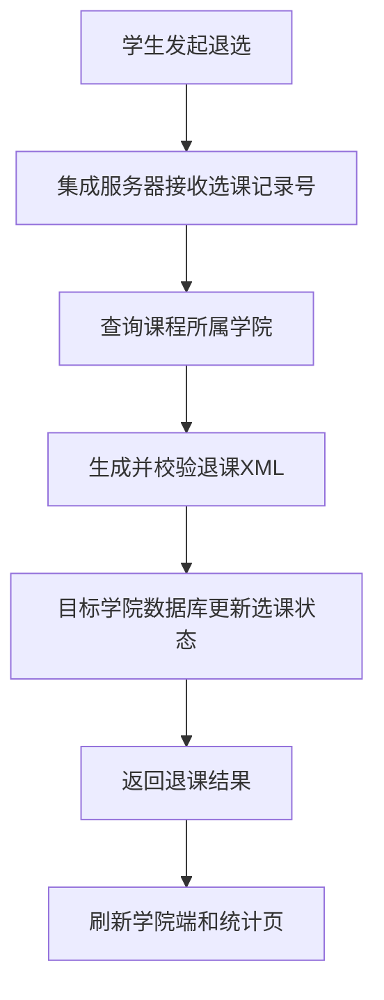

# 系统数据集成流程图

## 课程共享流程（对应教材图3-13）

```mermaid
sequenceDiagram
    participant AdminA as A学院管理员
    participant ServerA as A学院服务器
    participant Integ as 集成服务器
    participant ServerB as B学院服务器
    participant ServerC as C学院服务器

    AdminA->>ServerA: 1. 点击【执行课程共享】
    ServerA->>Integ: 2. 发送课程共享请求
    Integ->>ServerB: 3. 请求B学院课程信息
    Integ->>ServerC: 3. 请求C学院课程信息
    ServerB->>Integ: 4. 返回B学院课程XML
    ServerC->>Integ: 4. 返回C学院课程XML
    Integ->>Integ: 5. XSLT转换（本地→统一→A格式）
    Integ->>ServerA: 6. 返回整合后的课程XML
    ServerA->>ServerA: 7. 解析并存入数据库
    ServerA-->>AdminA: 8. 共享课程导入完成
```

## 跨系选课流程（对应教材图3-14）

```mermaid
sequenceDiagram
    participant StudentA as A学院学生
    participant ServerA as A学院服务器
    participant Integ as 集成服务器
    participant ServerB as B学院服务器

    StudentA->>ServerA: 1. 发送选课请求（B学院课程X）
    ServerA->>ServerA: 2. 检测为跨系选课
    ServerA->>Integ: 3. 转发选课请求
    Integ->>Integ: 4. XML验证 + XSLT转换
    Integ->>ServerB: 5. 转发转换后的选课信息
    ServerB->>ServerB: 6. 检查有效性并存储
    ServerB->>Integ: 7. 返回选课结果
    Integ->>ServerA: 8. 转发选课结果
    ServerA-->>StudentA: 9. 显示选课成功/失败
```

## 全局统计汇总流程（作业要求3）

```mermaid
flowchart TD
    A["集成服务器发起统计"] --> B["并行读取 A/B/C 学生 XML"]
    A --> C["并行读取 A/B/C 课程 XML"]
    A --> D["并行读取 A/B/C 选课 XML"]
    B --> E["标准模型归并"]
    C --> E
    D --> E
    E --> F["统计学生数、课程数、选课数"]
    F --> G["识别重叠课程与共享课程"]
    G --> H["前端可视化展示"]
```

## 集成环境退课流程（作业要求4）

```mermaid
flowchart TD
    A["学生发起退选"] --> B["集成服务器接收选课记录号"]
    B --> C["查询课程所属学院"]
    C --> D["生成并校验退课XML"]
    D --> E["目标学院数据库更新选课状态"]
    E --> F["返回退课结果"]
    F --> G["刷新学院端和统计页"]
```
