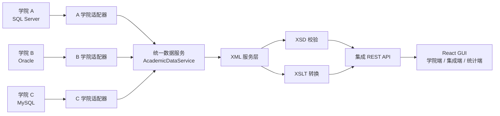
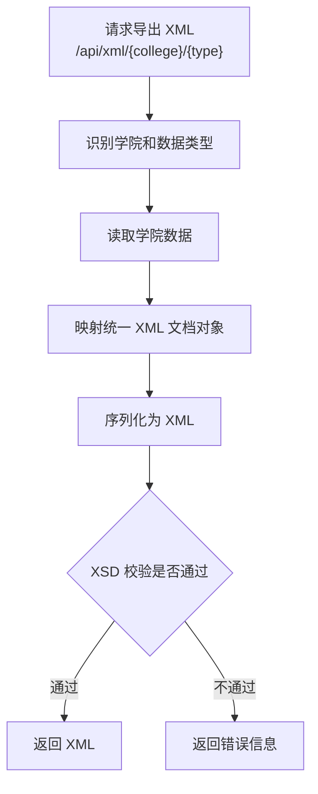
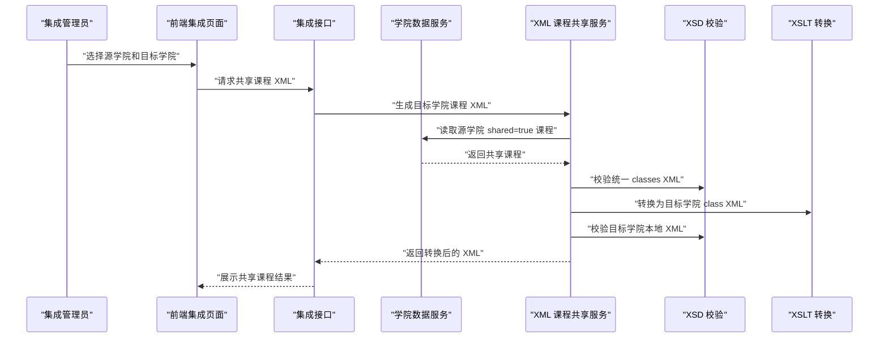
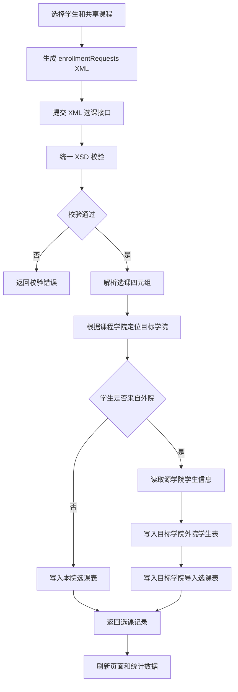
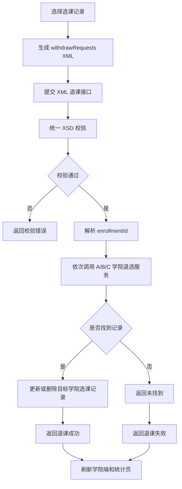
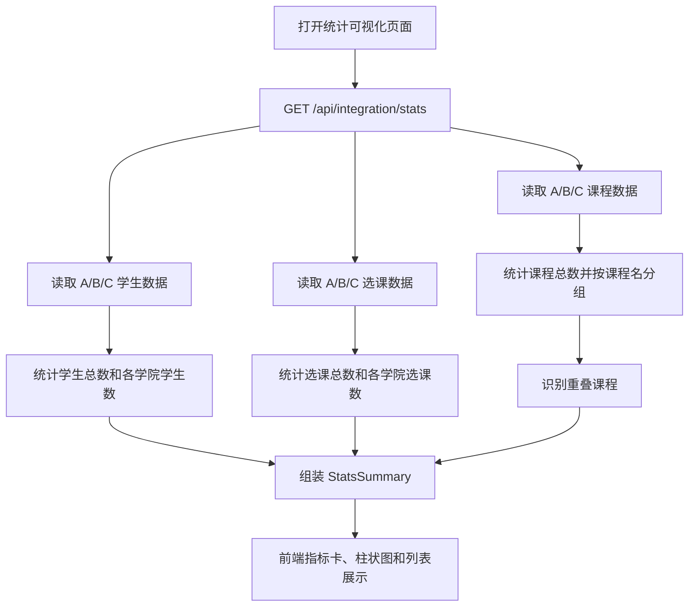
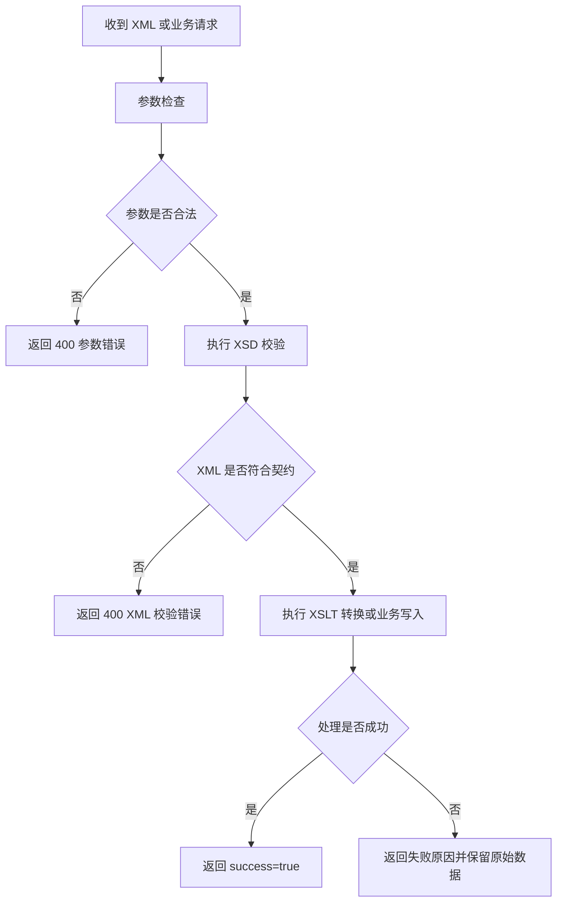

# 系统数据集成相关功能流程图

本文档汇总报告中可直接使用的流程图。Markdown 查看器支持 Mermaid 时可直接渲染，也可以将代码块复制到 Mermaid Live Editor、Typora、Obsidian 或 draw.io 中导出图片。

## 图 1：系统总体数据集成架构

## 图 2：XML 导出流程

## 图 3：课程共享流程

## 图 4：跨学院选课流程

## 图 5：集成退课流程

## 图 6：全局统计流程

## 图 7：数据集成异常处理流程

